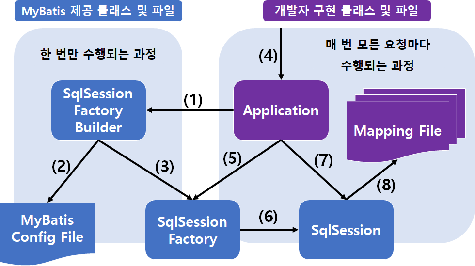

# MyBatis

<br/>

### JDBC

* Java Database Connectivity
* Java에서 DB를 연동해 쓸 수 있도록 하는 자바 API
* 프로그램 소스 안에 SQL 문을 작성하는 방식
* 다음 순서에 해당하는 코드들은 필수로 진행해야 사용 가능하다. (관리가 비교적 어렵다)

<br/>

#### JDBC 사용 순서

* JDBC 드라이버의 인스턴스 생성

  ```java
  Class.forName("driver name");
  ```

* JDBC 드라이버의 인스턴스를 통한 DBMS 연결(**Connection**) 생성 

  ```java
  Connection conn = DriverManager.getConnection("Database URL", "Account ID", "PW");
  ```

* Connection 객체를 통한 Statement 생성

  ```java
  Statement stmt = conn.createStatement();
  ```

* Statement 객체의 executeQuery() 를 이용한 쿼리보내기 및 ResultSet 으로 받아오기

  ```java
  ResultSet rs = stmt.executeQuery("select * from ... ");
  ```

* ResultSet, Statement, DB와 연결 닫기

  ```java
  rs.close();
  stmt.close();
  conn.close();
  ```

<br/>

* JDBC 방식은 위와 같이
  1. 드라이버 인스턴스를 생성하고,
  2. Connection 객체를 만들고,
  3. Statement 객체도 만든 후,
  4. Statement 객체의 executeQuery 메소드의 인자로 SQL 쿼리문을 날려 반환값을 ResultSet에 받고,
  5. rs.next() 등을 이용해 하나씩 처리 후,
  6. 모든 연결을 종료하는 과정을 거쳐서 사용해야 한다.

<br/>

<br/>

### MyBatis란?

* MyBatis는 기존 방식에 비해 DB와 연동하여 데이터를 좀 더 쉽게 사용할 수 있게 도와주는 프레임워크이다.
* 개발자가 지정한 SQL, 저장프로시저 그리고 몇가지 고급 **매핑**을 지원하는 퍼시스턴스 프레임워크이다. 
  * 퍼시스턴스 프레임워크 : CRUD를 다루는 클래스 및 설정 파일의 집합
* MyBatis는 데이터베이스 레코드에 원시타입과 Map 인터페이스 그리고 자바 POJO 를 설정해서 매핑하기 위해 XML과 애노테이션을 사용할 수 있다.
  * [POJO](https://happyer16.tistory.com/entry/POJOplain-old-java-object%EB%9E%80) : Plain Old Java Object, 특정 규약에 종속되지 않는 자바 객체
* SQL을 별도의 파일로 분리해서 관리한다.
* 약간 말이 어려울 수 있는데, 쉽게 말해서 자바 코드에서의 오브젝트와, 따로 작성해 놓은 SQL문을 각각 매핑해주는 기능을 지원하는 것이다. 즉, 매핑된 특정 메소드를 호출하면 해당 SQL문이 DB에서 수행되고, 그 결과를 반환하게 되는 것이다.

<br/>

### MyBatis를 쓰는 이유?

* **접근이 쉽고 간단하며 생산성이 높아진다.**

  * DBCP만 쓰면 위에서 언급한 Connection, ResultSet, Statement 등 객체들에 대한 관리도 해야한다.

  * MyBatis에서는 JDBC로 처리하는 상당 부분의 코드와 파라미터 설정, 결과 매핑 등을 대신 해준다.
  * 물론 DB에 연결되는 과정이 JDBC를 사용할 때와 같지만, 그걸 '알아서 적절히' 해주는 것이다.
  * 따라서 개발자가 작성해야 할 코드는 눈에띄게 줄어든다.
  * 즉, 빠른 개발이 가능하며 이해하기도 쉽다.
* **SQL문과 프로그램 코드가 독립적이다.**
  * 기존 JDBC 방법의 경우, 쿼리가 달라질 경우 자바 코드를 수정해야 하기 때문에, 독립적이지 못하다.
  * 그에 비해 MyBatis에서는 xml 파일에 쿼리 작성을 따로 하여 관리한다.
  * 즉, SQL문이 바뀐다고 해서 java 파일을 다시 컴파일하지 않아도 된다.

<br/>

### MyBatis 주요 구성 컴포넌트의 역할

#### MyBatis가 제공하는 클래스 및 파일

* MyBatis 설정파일 : ~config.xml 형태의 파일을 말한다.
  * DB 정보 및 Mapping 되는 파일의 경로 등 고정된 모든 개발 환경 및 운영정보를 설정하는 파일이다.
* SqlSessionFactoryBuilder : MyBatis 설정파일을 참조하여, SqlSessionFactory를 생성한다.
* SqlSessionFactory : SqlSession을 생성
* SqlSession : 핵심적인 역할을 하는 클래스로, Mapping된 SQL을 실행하는 역할을 한다.
  * 내부적으로 트랜잭션 관리를 수행하기도 한다.
  * 해당 Object는 Thread-Safe 하지 않기 때문에, 스레드마다 필요에 따라서 생성하여 사용한다.

<br/>

#### 개발자에 의해 구현되는 클래스 및 파일

* mapping 파일 : DB에 대해 수행할 SQL문을 작성하는 xml 파일을 말한다.
  * SQL문과 OR Mapping을 설정해준다.

<br/>

#### 컴포넌트 호출 순서



1. Application에서 SqlSessionFactoryBuilder라는 인터페이스를 호출한다.
2. 해당 빌더가, MyBatis Config File 정보를 읽어온다.
3. 빌더는 그 정보를 토대로 SqlSessionFactory를 생성해준다.
4. 개발자가 Application을 통해서 CRUD 등 DB에 access하는 기능의 메소드를 호출한다.
5. 그러면서 Application상에서 SqlSessionFactory를 호출한다.
6. 이 때 SqlSessionFactory가  SqlSession을 생성하고, 개발자가 작성한 Application 코드에 return 해준다.
7. 리턴 받은 Application에서는 SqlSession에 있는 메소드를 호출하면 된다.
8. SqlSession이 핵심 역할을 해주는데, 개발자가 작성한 Mapping File 즉, SQL문을 호출해주는 기능을 한다.

<br/>

### MyBatis 사용법?

* build.gradle 파일에 의존성 추가하기

```java
//ex)
compile group: 'org.mybatis', name: 'mybatis', version: '3.5.4'
```

<br/>

<br/>

출처

[Mybatis 공식 한국어 레퍼런스](https://mybatis.org/mybatis-3/ko/index.html)

[Mybatis 사용법 정리 - 블로그](https://m.blog.naver.com/PostView.nhn?blogId=songintae92&logNo=221216410360&proxyReferer=https:%2F%2Fwww.google.com%2F)

[Mybatis를 써야하는 이유 - 티스토리](https://goodsy.tistory.com/5)

[Spring Framework Basic 16강 MyBatis 개요 | T아카데미](https://www.youtube.com/watch?v=9b5P4YiyqOY&feature=youtu.be)

