# Vue.js

### 정의

* 사용자 인터페이스를 만들기 위한 점진적인 프레임워크이다. 핵심 라이브러리는 뷰 레이어에만 포커스를 맞추어 다른 라이브러리나, 기존 프로젝트와의 통합이 쉽다.
* 접근하기 쉽고(Approachable), 변하기 쉽고(Versatile), 강력하며(Performant), 유지보수가 쉽고(Maintainable), 테스트 가능하다(Testable).

 

### 시작하기

* 기본적으로 html 파일, js 파일, css 파일로 나누어 vue를 구성하는듯 하다.
* 이 때 html 에서 {{ }} 기호 안에서 호출하고 있는 내용이 바로 js파일에서 해당 id와 연결된 객체 안에 data의 product 값이다.
* js 파일에서 살펴보면, el은 어디에 해당 객체가 연결되는지 판단하기 위한 요소이다.
* 따라서 #app 이라는 id에 해당하는 태그와 app이라는 이름의 Vue 객체를 연결시키는 것.

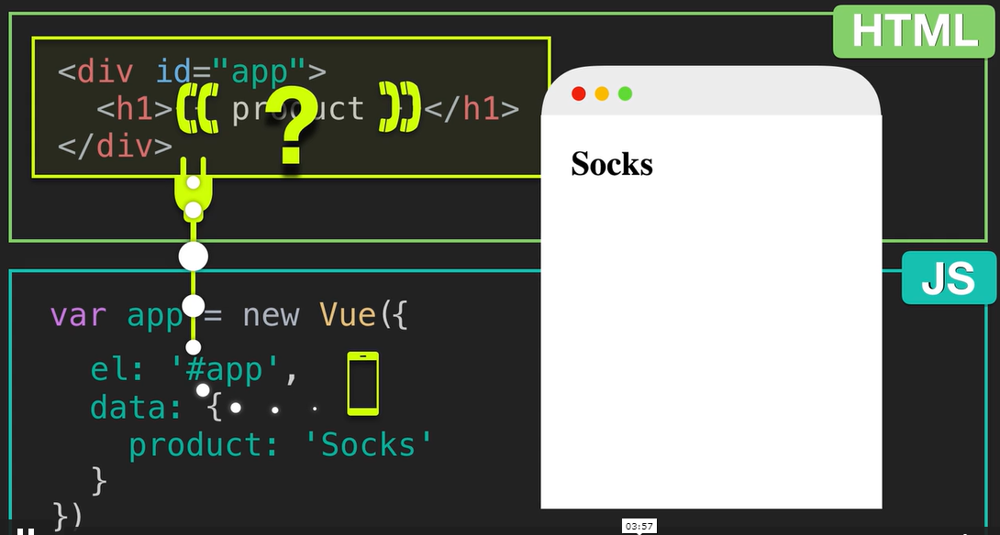

 

### {{ }} Expression

* 아래 그림과 같이, 문자열을 조합하거나 각 다른 data 요소를 호출할 수도 있고, 참 거짓을 판단할 수 있으며 문자열 문자 각각을 쪼개 역순으로 이어붙일 수도 있다.

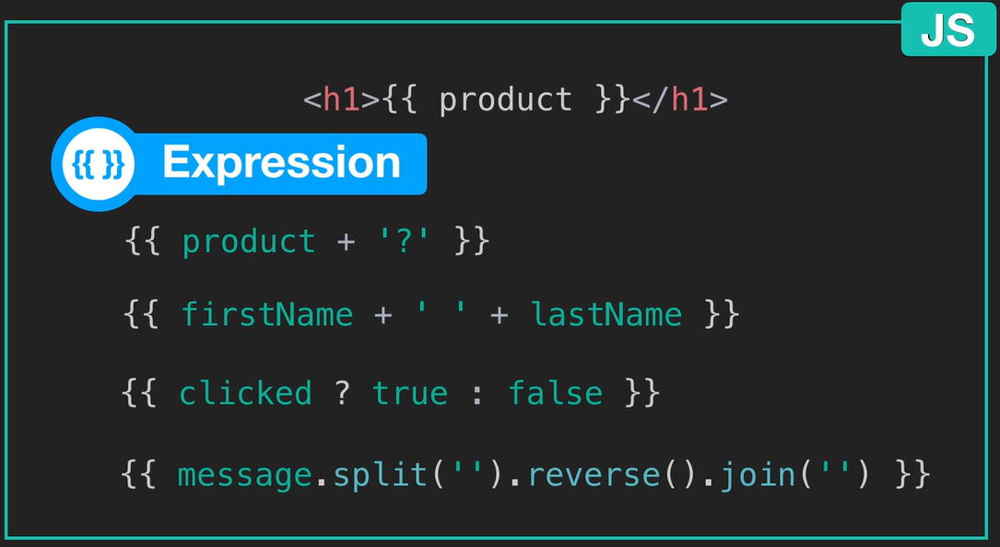

 

### Reactive vue

* 아래 상황에서, data의 product 내용을 바꾸면, html에서 호출한 {{ product }} 내용 모두가 변경된다.
* vue는 반응형이기 때문에, 변경하는 즉시 내용도 바뀐다.

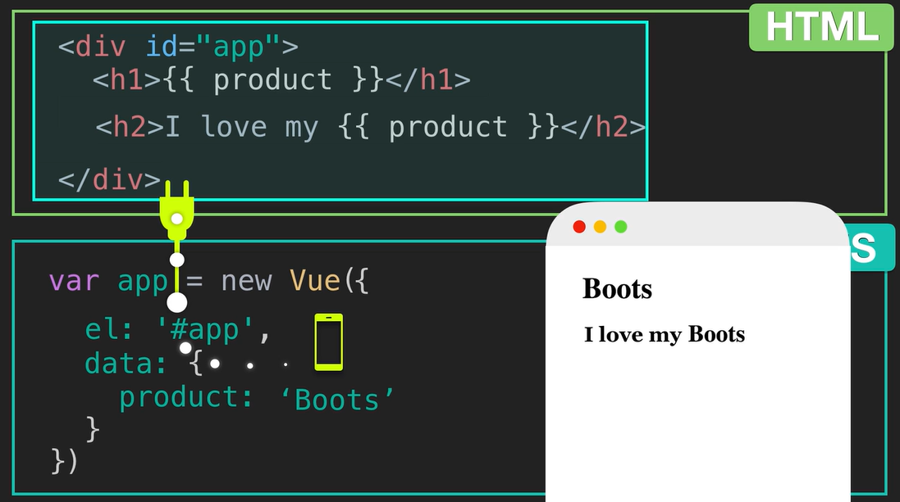

 

* js 파일 대신 콘솔을 이용해 app.product = 'change' 등을 입력하면 변화를 더 잘 확인할 수 있다.

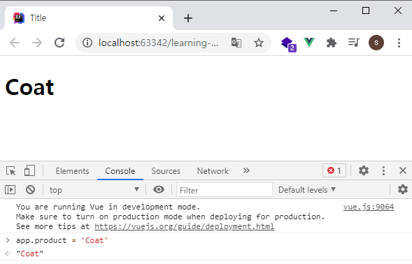

 

### Attribute binding : v-bind

* 데이터는 HTML 속성에 바인딩될 수 있다.
  * v-bind: 데이터를\_바인딩\_할\_속성
  * 일반적으로 자주 쓰이기 때문에, v-bind를 생략하고 : 만 쓰기도 한다.
* vue에서 데이터 바인딩은, Vue 인스턴스 내부의 데이터 개체인 소스에 직접 연결되거나 바인딩 되는 것을 의미한다. 이 경우 데이터는 Vue 인스턴스의 데이터 속성의 따옴표 안에서 바인딩 할 데이터를 참조한다.

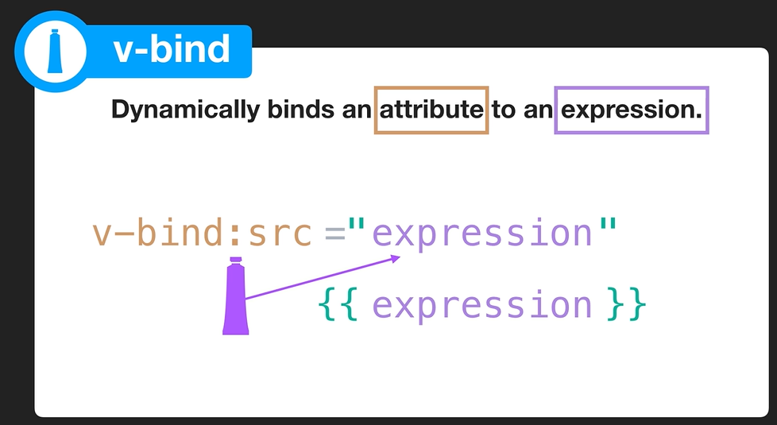

 

### Conditional rendering : v-if

* if, else if, else 조건문과 같다.
  * v-if="attribute"
  * 연결된 속성 또는 조건문이 참이면 표시한다.

 

#### Conditional viewable : v-show

* DOM에 항상 존재하지만, 조건이 충족되는 경우에만 페이지에 표시되도록 하기 위해 사용한다.
  * display: none 요소에 CSS 속성을 조건부로 추가하거나 제거한다.

 

### List rendering : v-for

* 일반적인 for 문과 똑같다.
  * v-for="alias in Collection"
  * 임시변수 in 배열 형식으로 똑같다.
  * 출력 결과는 {{ }} 로 묶어 해당 alias의 내용을 출력하도록 한다.

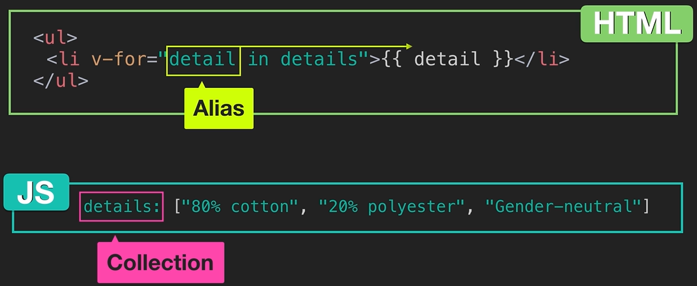

* 사용할 때, v-for 렌더링 된 각 요소에 고유한 키를 제공하는 것이 좋다.

 

### Event process : v-on

* 이벤트를 수신할 수 있도록 하는데 사용된다.
  * v-on: event
  * v-on 대신 @로도 대신 쓸 수 있다.
* 과정을 메소드로 만들어 트리거를 사용할 수도 있다.
* 메소드 이름만 적거나, 전달할 인자가 있는 경우 (_)로 인자를 함께 적어 호출할 수 있다.

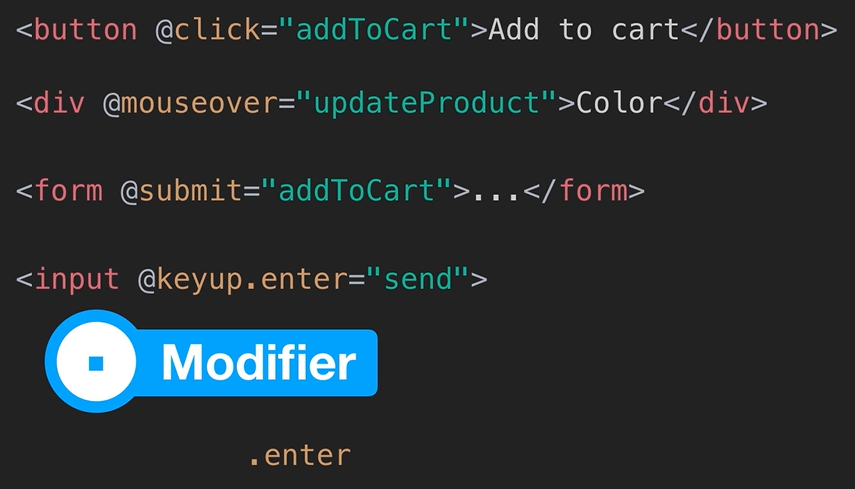

 

#### Method

* Vue 인스턴스의 항목 중 하나로 함수를 만들 수 있는 항목이다.
  * method: { methodName: function() {  this.value = 0} }
  * method: { methodName(value) { this.value = value } }
  * function()은 생략하여 사용 가능하다.

 

### class, style binding

* 스타일도 바인딩 할 수 있다.
* 다음과 같이 색깔로 예를 들어, 색깔 속성인 color에 연결된 data의 color 속성 값은 red이다.
* 그럼 해당 color는 red로 치환되어 스타일을 바꾸어 출력하게 된다.

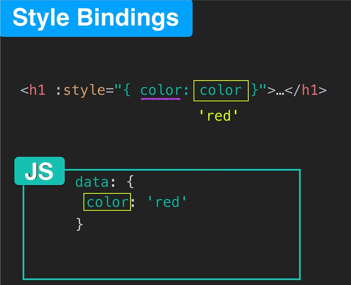

 

* 당연히 fontSize 속성도 마찬가지.
* 위 color의 예시와 동일한 방법이다.

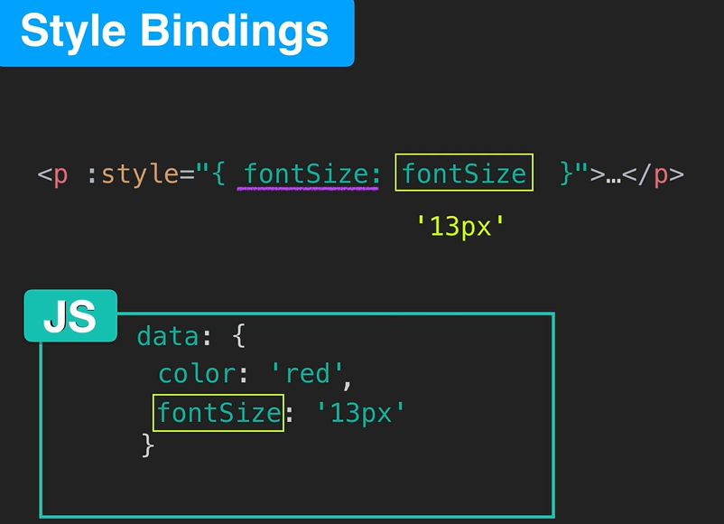

 

* 위 두 가지 속성을 하나의 Object로 묶어 사용할 수도 있다.

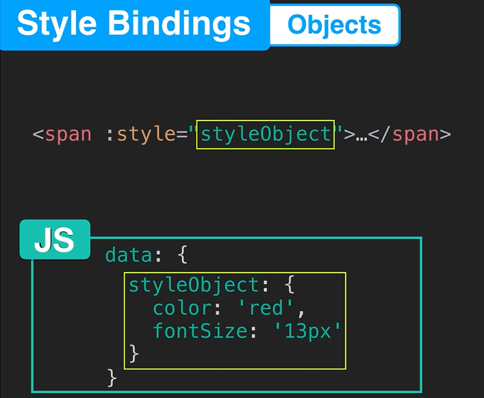

 

* 이렇게 오브젝트를 여러 개로 나누어 묶어서 Array 형태로 적용할 수도 있다.

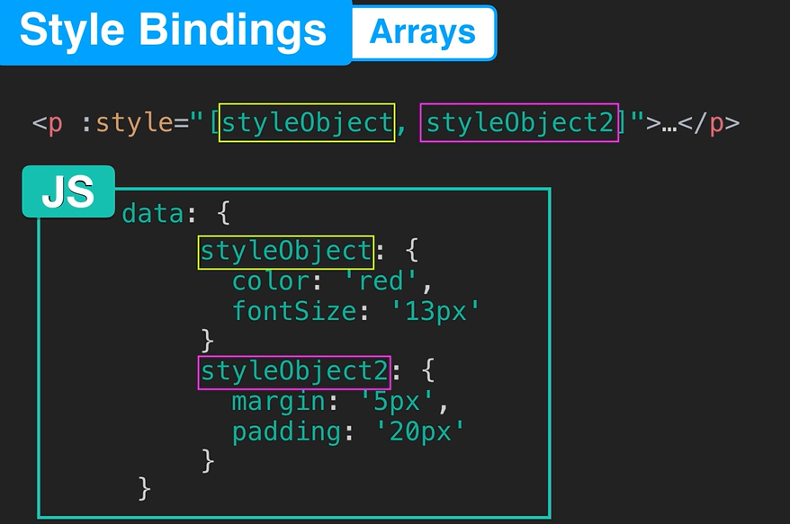

 

 

 

### Ref

[Vue.js 시작하기](https://kr.vuejs.org/v2/guide/index.html#Vue-js%EA%B0%80-%EB%AC%B4%EC%97%87%EC%9D%B8%EA%B0%80%EC%9A%94)

[이미지 출처 : Vue Mastery Intro to Vue  2 튜토리얼 영상 캡쳐](https://www.vuemastery.com/courses/intro-to-vue-js/vue-instance/)

https://www.vuemastery.com/courses/intro-to-vue-js/class-&-style-binding

### 할 일

1. 카톡 링크 블로그들 정독하기
2. 스프링 프레임워크 무료강의 세 개 순서대로 보기
3. 틈틈히 vue의 라우터 개념 (라이브러리) 전까지 보기
4. spring boot security로 넘어갈 수 있게 이전 단계 확실히 하기