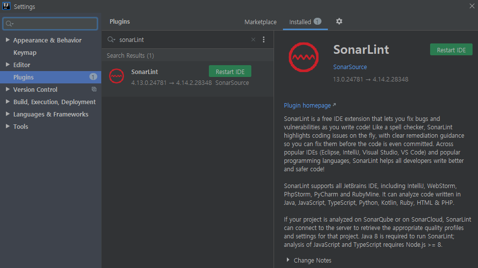
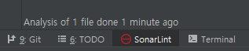
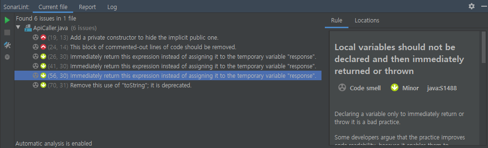
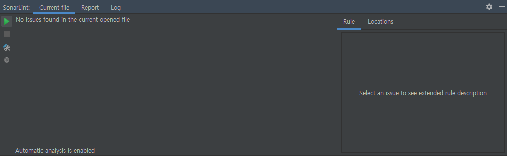

# sonarLint

 

### sonarLint란 무엇인가?

* IDE 통합 개발환경에서 제공하는 **코드 품질 관리 Plug-in**이다.
* commit 이전 단계에서 코드 자체의 품질 문제에 대해 감지하고, 수정하는데 도움을 준다.
* 위험성이 있는 코드나 미리 정의된 규칙, 코딩 표준에 준수하는지 분석한다.
* SonarLint 사용을 위해서는 Java 8 이상이 필요하다.

 

### 품질 관리 요소 기준

* [코드 스멜](https://ko.wikipedia.org/wiki/%EC%BD%94%EB%93%9C_%EC%8A%A4%EB%A9%9C)(Code smell)
  * 유지보수성(Maintainability)을 고려하여 문제를 일으킬 가능성이 있는 코드인지를 판단한다.
  * 모듈성(modularity), 이해가능성(understandability), 변경가능성(changeability), 테스트용의성(testability), 재사용성(reusability) 등이 포함된다.
* 버그(bugs)
  * 잠재적인 버그나 예상되는 동작을 하지 않는 코드를 판단한다.
  * 어떤 기준 시점에서부터 서비스 수행의 지속성에 대한 척도로 장애가 발생하기까지의 시간과 관련된 신뢰성(Reliabliity)을 기준으로도 판단한다.
* 취약점(Vulnerabilities) 또는 보안(Security)
  * 잠재적인 약점이 될 수 있는 보안상의 이슈에 대해 취약성을 판단한다.
* [코드 커버리지](https://ko.wikipedia.org/wiki/%EC%BD%94%EB%93%9C_%EC%BB%A4%EB%B2%84%EB%A6%AC%EC%A7%80)(Coverage)
* 중복(Duplications)
  * 코드 품질 저해의 요인 중 하나인 코드 중복을 판단한다.
* 크기(Size)
  * 코드의 라인 수 및 구조상에 존재하는 여러 지표를 가지고 소스 코드의 사이즈에 대해 판단한다.
* 복잡성(Complexity)
  * 코드의 흐름상에 존재하는 논리적인 선형 경로 개수인 순환 복잡도 등을 측정하여 판단한다.

 

#### 코드 품질 지표(참고)

| **항목**       | **세부항목**   | **설명**                         | **비고**           |
| :------------- | -------------- | -------------------------------- | ------------------ |
| **Code Size**  | NCLOC          | Non Comment Lines of Code        | 유효코드라인 (LoC) |
| ..             | NOM / NOC      | Number of Methods / Classes      |                    |
| **Complexity** | MCC            | McCabe Cyclomatic Complexity     |                    |
| ..             | MLOC           | Method Lines of Code             | 메소드당 라인 수   |
| ..             | CLOC           | Class Lines of Code              |                    |
| **Modularity** | Martin Metrics | Packaged Based Abstraction level | 결합도 관련        |
| **OO Metrics** | LCOM           | Lack of Cohesion Methods         | 응집도 관련        |
| ..             | SI             | Specialization Index             | LSP 관련           |
| ..             | DIT            | Depth of Inheritance Tree        | 결합도 관련        |

 

### 사용 방법

* IDE 개발 환경에서는 간단하게 Plug-in store에서 install 할 수 있다.
  * 인텔리제이, 이클립스, 비주얼 코드 등에서 사용 가능하다.
* 처음 설치하면 IDE 재시작을 필요로 한다.

 

* 설치가 되면, 하나의 탭이 생겨 언제든지 확인할 수 있다!

 

* 아래와 같이 현재 Current file에 결함 등이 존재할 경우 알려주거나, 코드를 commit 할 때 해당 사항을 체크하고 넘어가도록 안내 메시지를 띄워준다.

 

* 모든 결함 및 권장사항을 해결하고 난 뒤 아무런 이슈가 발견되지 않은 상태.

 

 

### Ref

[내 코드를 자동으로 리뷰해 주는 IDE플러그인](https://yongdev91.tistory.com/7)

[SornarQube 그리고 코드 품질](https://brunch.co.kr/@joypinkgom/47)

[코드 품질을 높여주는 테스트 주도 개발 알아보기](https://www.samsungsds.com/kr/insights/Test-Driven-Development.html)